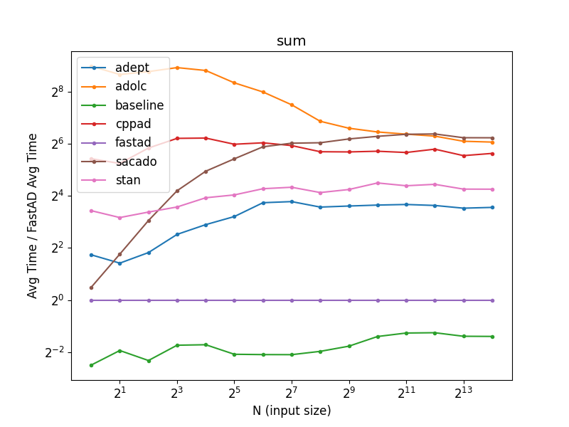
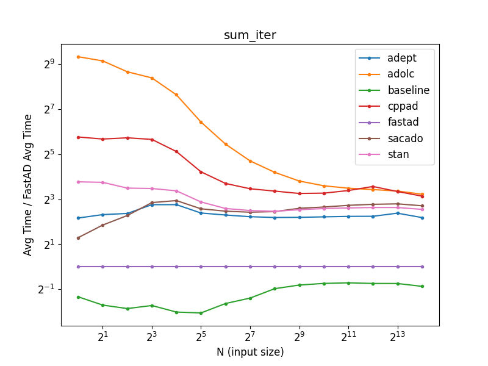
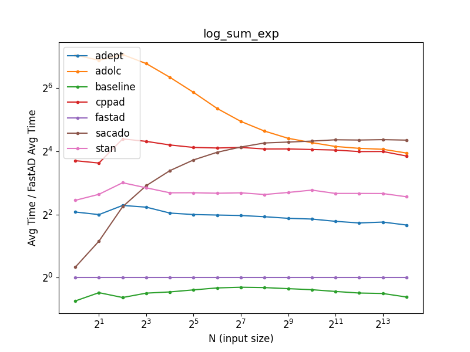
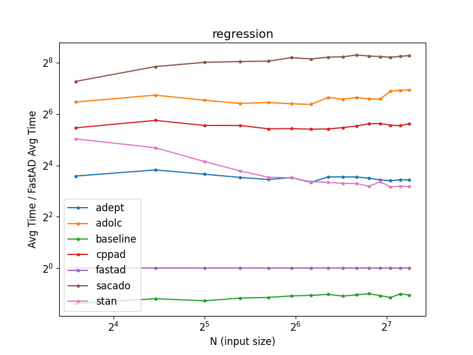

# AD Benchmark

This is a repository dedicated to benchmarking automatic differentiation libraries for research purposes.
This benchmark has only been tested on MacOS Catalina.

## Installation

First clone the repository:
```
git clone https://github.com/JamesYang007/ADBenchmark.git
```

Then run the setup script to install all dependencies (and their dependencies):
- [Adept 2.0.8](http://www.met.reading.ac.uk/clouds/adept/)
- [ADOL-C 2.7.2](https://github.com/coin-or/ADOL-C)
- [CppAD 20200000](https://coin-or.github.io/CppAD/doc/cppad.htm)
- [Sacado 13.0.0](https://github.com/trilinos/Trilinos/tree/master/packages/sacado)
- [FastAD 3](https://github.com/JamesYang007/FastAD)
- [STAN math 3.3.0](https://github.com/stan-dev/math)

```
./setup.sh
```
Note that the setup will use GCC10.
If this is not available, you have to manually change the compiler version to the one that is available
by editing all instances of `gcc-10` and `g++-10` in `setup.sh`.
If you must run the setup again for a particular library, 
delete the folder associated with that library in `lib` and run the script again.

We have not provided scripts for the following changes and we ask the users to manually make these changes:
- Add `math::` in front of `apply` in `lib/stan-dev-math/stan/math/rev/functor/adj_jac_apply.hpp` line `513`.
  Compiling with C++17 standard raises error due to ambiguity with `std::apply`.

To build benchmarks:
```
./clean-build.sh -DCMAKE_C_COMPILER=gcc-10 -DCMAKE_CXX_COMPILER=g++-10
```
If GCC10 is not available, just replace `gcc-10` and `g++-10` with the correct alias for the available version
(e.g. `gcc-8` and `g++-8` if GCC8 is available).
This will create directories for each library in `build/benchmark`
and build each test as a separate executable in these directories.
__Note: for the safest build results, use the same compiler that you used in setup.__

We wrote a Python script in `analyze` called `analyze.py` that 
scrapes `build/benchmark` directory for all tests in each library directory,
runs the benchmark programs,
and saves the absolute times (in nanoseconds) and 
the plots of relative time against FastAD for each test in `docs/data` and `docs/figs`, respectively.
To run the script:
```
cd analyze
python3 analyze.py
```
__It is important to be inside `analyze` directory__.

## Benchmark Results

### Sum


### Sum (Iterative)


### Product


### Product (Iterative)


### Log-Sum-Exponential


### Matrix Product and Sum Elements


### Normal-Log-PDF


### Regression Model


### Stochastic Volatility Model

